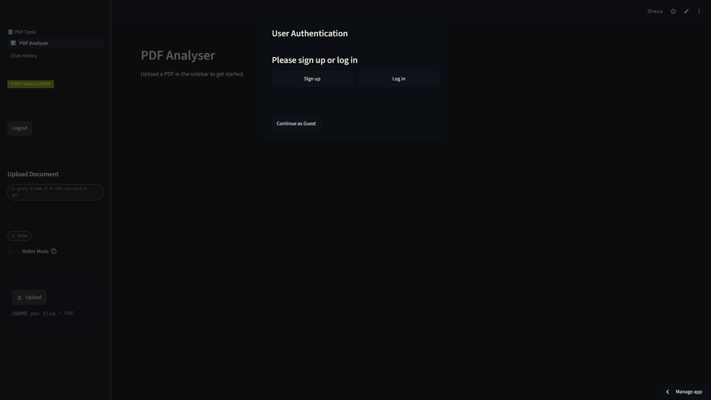
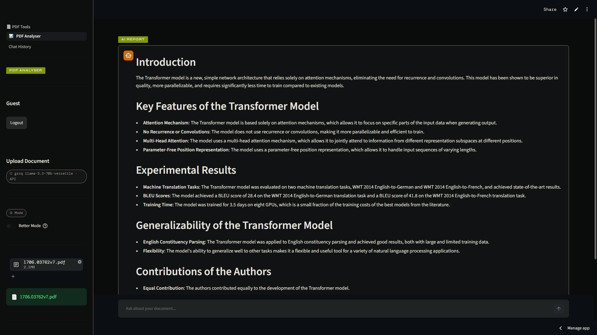
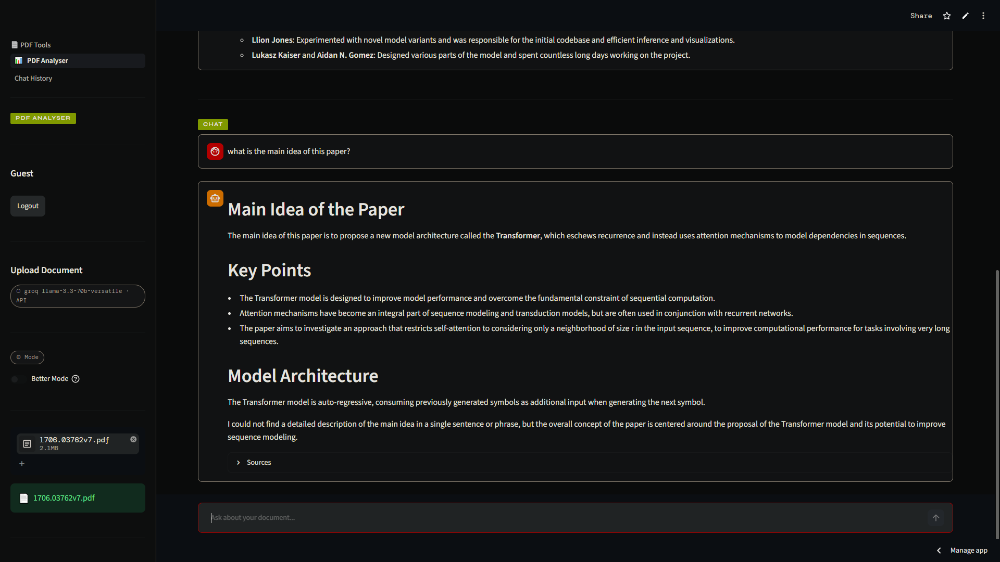
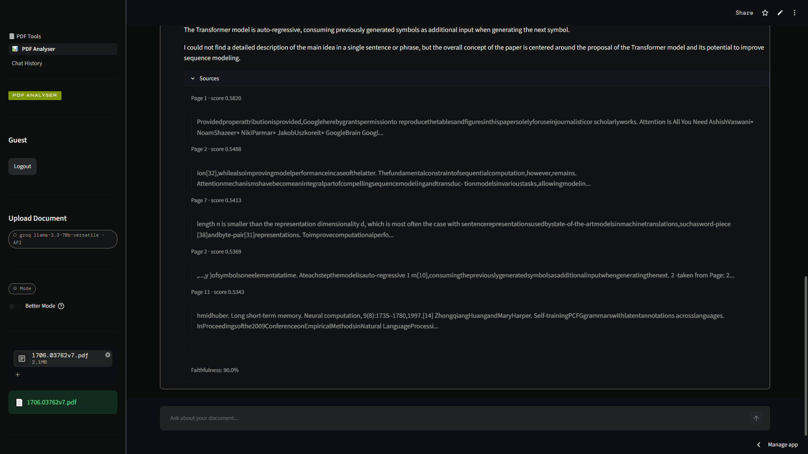
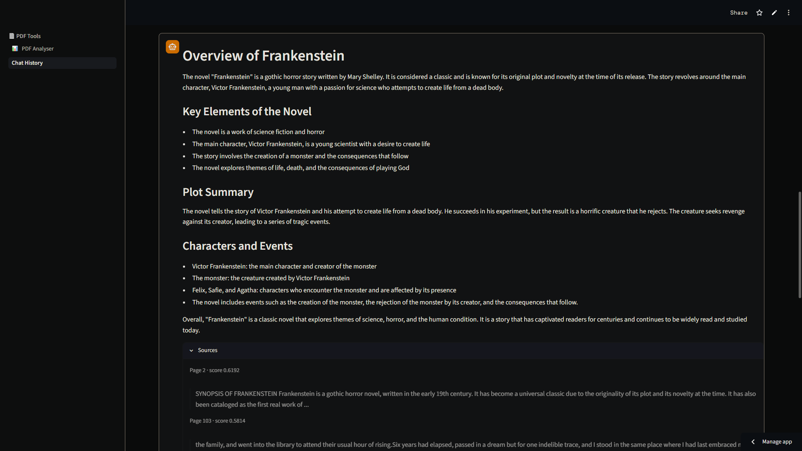

# PDF Analyser

### AI-Powered PDF Analysis & Conversational Document Intelligence

Upload any PDF, generate instant insights, and chat with your documents using advanced Retrieval-Augmented Generation (RAG).

**Live Application:** https://analyser-for-pdf.streamlit.app/

---

## Overview

PDF Analyser transforms lengthy documents into an interactive AI experience.

Instead of manually reading hundreds of pages, users can upload a PDF, receive an AI-generated summary, and ask natural language questions to instantly extract information from the document.

Designed for reports, research papers, business documents, manuals, contracts, academic material, and more.

---

## Key Features

### AI Report Generation

Generate a concise report highlighting the document's purpose, main topics, and key insights.

### Conversational PDF Chat

Ask questions in plain English and receive context-aware answers grounded in the uploaded document.

### Source Citations

Every response includes supporting document references so users can verify where information originated.

### Advanced Retrieval Mode

For complex questions spanning multiple sections, Better Mode performs additional retrieval steps to improve answer quality and context coverage.

### Long-Term Conversation Memory

Maintains chat context through intelligent summarization, enabling extended conversations without degrading performance.

### Fast Semantic Search

Uses vector embeddings and similarity search to locate the most relevant content across the entire document.

---

## Application Screenshots

### Login Page

### Main Dashboard

### PDF Question Answering

### Source Citations

### Chat History

### Conversation Memory

---

## How It Works

1. Upload a PDF document
2. The document is processed and indexed
3. AI generates an initial summary report
4. Ask questions in natural language
5. Relevant document sections are retrieved
6. Responses are generated using retrieved context
7. Citations are provided for transparency and verification

---

## Technology Stack

| Component            | Technology                           |
| -------------------- | ------------------------------------ |
| Frontend             | Streamlit                            |
| Large Language Model | Groq Llama 3.3 70B                   |
| Embeddings           | BAAI BGE Base v1.5                   |
| Vector Database      | FAISS                                |
| PDF Processing       | pdfplumber                           |
| Semantic Retrieval   | Retrieval-Augmented Generation (RAG) |
| Deployment           | Streamlit Community Cloud            |

---

## Use Cases

* Research Paper Analysis
* Business Report Review
* Technical Documentation Search
* Educational Material Exploration
* Policy & Compliance Document Review
* Internal Knowledge Base Querying
* Contract & Legal Document Assistance

---

## Live Demo

Try the application:

**https://analyser-for-pdf.streamlit.app/**

---

## Author

**Ali Akbar**

AI Engineering • Machine Learning • Data Science

GitHub: https://github.com/AliAkbar4025
